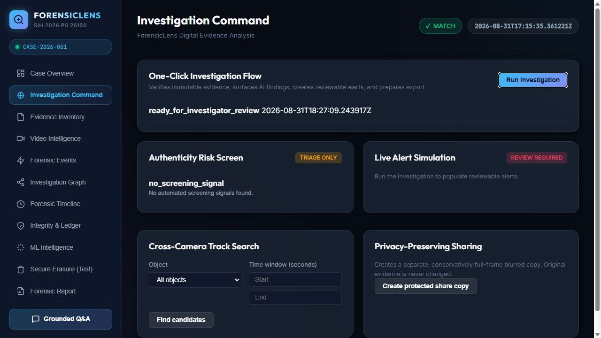

# ForensicLens

ForensicLens is an investigator-first, vendor-neutral CCTV/DVR/NVR evidence-analysis prototype for SIH PS 26150. It preserves source evidence, turns video intelligence into reviewable findings, and produces traceable case reports.

## What the demo shows

1. Ingested source files are hashed and held read-only.
2. Video intelligence detects/tracks people and vehicles, then derives review events.
3. Automated hash verification, AI-assisted alerts, and conservative authenticity-risk screening protect evidence integrity.
4. An investigator confirms or rejects findings and records case notes.
5. Track search returns class/time candidates only; it never claims identity.
6. A privacy-sharing action creates a hashed, full-frame-blurred *derived* video; the original stays untouched.
7. Reports export the evidence inventory, integrity chain, review decisions, and screening caveats.

## Architecture

```text
Immutable evidence -> SHA-256 / custody ledger -> video detection + tracking
       -> forensic events + risk screening -> investigator review / notes
       -> alerts, privacy-derived share copy, grounded Q&A -> exportable report
```

## Run locally

Use Python 3.11+ in the project root:

```powershell
python -m venv .venv
.\.venv\Scripts\Activate.ps1
pip install -r requirements.txt
python dashboard.py
```

Open http://127.0.0.1:5000 to explore the dashboard. The first full analysis may take time on CPU because it uses YOLOv8.

### One-command hackathon demo

The included sample case contains a VIRAT surveillance video and image exhibits in `dataset/raw`. After installing dependencies once, run:

```powershell
python run_hackathon_demo.py
```

This starts the dashboard with the included sample case. For the strongest live demonstration: review findings in **Forensic Events**, save an investigator note, and export the report.

### Add Camera 2–4 feeds

Open **Video Intelligence**, choose the additional CCTV files using **Add & Analyze Feeds**, then wait for the analysis to finish. For each file, ForensicLens stores a new intake hash, analyzes it as a separate feed, and keeps event markers synchronized to the selected video. Existing source evidence is never overwritten.

Use distinct filenames such as `camera_entrance.mp4`, `camera_corridor.mp4`, and `camera_exit.mp4`. The provided single VIRAT clip remains the reliable baseline sample case; add genuinely different viewpoints for a meaningful multi-camera demonstration.

To run the complete deterministic demo and generate reports:

```powershell
python demo.py
```

To run tests:

```powershell
python -m pytest -q
```

## Responsible-use boundaries

- AI events, alerts, anomaly scores, and model confidence scores are **triage aids**, not factual conclusions. Every event remains reviewable by an investigator.
- Track search is limited to local tracker candidates and class/time criteria. It does not identify a person or vehicle across cameras.
- The authenticity screen detects only simple sampled-frame signals; it does not prove deepfake content, editing, or authenticity.
- Privacy export is a separate full-frame-blurred artifact because this prototype does not yet include validated face/license-plate detection. It retains its own hash and source verification record.
- The app never writes to `dataset/raw`; source evidence remains immutable.

## Hackathon pitch

“ForensicLens lets an investigator move from raw CCTV to a reviewable, integrity-preserving case narrative in minutes—without asking them to trust the AI blindly.”

The complete two-minute narration is in [HACKATHON_PITCH.md](HACKATHON_PITCH.md).

## Screenshots

Start the dashboard and capture your team’s final visuals before submission. Recommended shots:

1. **Case Overview** — evidence counts and integrity status.
2. **Video Intelligence** — synchronized multi-camera feed and event markers.
3. **Forensic Events** — an investigator’s confirmed/rejected decision and case note.
4. **Forensic Report** — the final export controls and traceability summary.

Store them under `docs/screenshots/` and replace the links below before submitting:


